# 面向科研论文的细粒度多模态证据图 RAG

这是一个以硕士论文为目标的可运行原型：从科研 PDF 中抽取原句、原图、图注、图片引用句和折线图数据，构建可回链页码与 bbox 的异构证据图；检索阶段返回满足证据依赖且不超过上下文预算的跨论文最小证据森林。

当前主路线已更新到 2025–2026 年开源模型，基础算法 HGT、PCST 仅作为轻量结构适配器和候选骨架，不作为“首次提出”的创新声明。

## 系统主链路

```mermaid
flowchart LR
    PDF["科研 PDF"] --> MU["MinerU2.5 / 当前 MinerU"]
    MU --> EG["科研异构证据图"]
    EG --> CT["PP-Chart2Table / VLM 自集成"]
    EG --> QE["Qwen3-VL-Embedding-2B"]
    CT --> QE
    QE --> QD["Qdrant 分类型召回"]
    QD --> HGT["关系监督 HGT 候选增强"]
    HGT --> RR["Qwen3-VL-Reranker-2B 原图精排"]
    RR --> PCST["PCST 多尺度候选骨架"]
    PCST --> CL["科研证据依赖闭包"]
    CL --> BF["硬预算跨论文证据森林"]
    BF --> VLM["Qwen3-VL 回答与引用校验"]
```

## 两个论文创新点

1. **图结构约束的科研多模态索引**：使用 Qwen3-VL 统一表示文本和图片，把 Figure-Caption-Mention-ChartData 的真实论文关系变成结构监督；轻量 HGT 只在候选集上学习关系增强，输出句子、图片和曲线数据级定位。
2. **证据闭包约束的硬预算森林检索（EC-BFR）**：PCST只生成候选骨架；随后在原始有向异构图上补齐图注、原图、引用句和曲线来源等必要依赖，闭包后重新计费，并在严格预算内选择跨论文证据森林。

不能宣称“首次多模态Graph RAG”“首次分层文档图”“首次预算图检索”或“首次使用PCST”。2025年的 LILaC 和2026年的 MAGE-RAG 已覆盖相近方向；本项目的差异边界见 [创新点与相关工作](docs/INNOVATION.md)。

## 关键开源依据

- [MinerU2.5](https://arxiv.org/abs/2509.22186) / [MinerU代码](https://github.com/opendatalab/MinerU)
- [Qwen3-VL-Embedding与Reranker](https://arxiv.org/abs/2601.04720) / [官方代码](https://github.com/QwenLM/Qwen3-VL-Embedding)
- [Qwen3-VL](https://arxiv.org/abs/2511.21631) / [官方代码](https://github.com/QwenLM/Qwen3-VL)
- [LILaC](https://arxiv.org/abs/2602.04263) / [代码](https://github.com/joohyung00/lilac)
- [MAGE-RAG](https://arxiv.org/abs/2606.15906) / [代码](https://github.com/laonuo2004/MAGE-RAG)
- [PP-Chart2Table文档](https://huggingface.co/docs/transformers/main/model_doc/pp_chart2table)
- [图表自集成解析](https://arxiv.org/abs/2605.27298)

## 代码地图

| 路径 | 职责 |
|---|---|
| `src/paper_rag/parsing` | MinerU版本隔离、句子切分、图引用和bbox回填 |
| `src/paper_rag/chart` | PP-Chart2Table、VLM自集成及DePlot基线 |
| `src/paper_rag/embedding` | Qwen3-VL-Embedding、HTTP客户端、GME历史基线 |
| `src/paper_rag/evidence_graph` | 异构证据图、关系构建和ChartData来源记录 |
| `src/paper_rag/models` | 2048→256维HGT结构适配器及训练损失 |
| `src/paper_rag/reranking` | Qwen3-VL原图/文本混合重排与HTTP客户端 |
| `src/paper_rag/retrieval` | RRF、PCST、类型闭包和EC-BFR |
| `src/paper_rag/generation` | 证据序列化、Qwen3-VL兼容API和引用ID校验 |
| `services` | Embedding、Reranker和主检索HTTP服务 |
| `tests` | 不下载模型即可运行的算法与接口测试 |

## 开始使用

部署前必须重建旧的1536维GME索引和HGT产物；Qwen3-VL-Embedding-2B默认使用2048维。完整安装、模型服务、索引重建、运行命令和验收门见 [部署文档](docs/DEPLOYMENT.md)。模块输入输出见 [系统架构](docs/ARCHITECTURE.md)，完整论文选型见 [论文依据与最终算法选型](论文依据与最终算法选型.md)。

本仓库不复制 MinerU、Qwen、PP-Chart2Table、PyG 或 pcst_fast 的源码，只提供适配层；第三方组件保留各自许可证。2026年的部分工作仍为预印本，论文中应如实标注发表状态。
